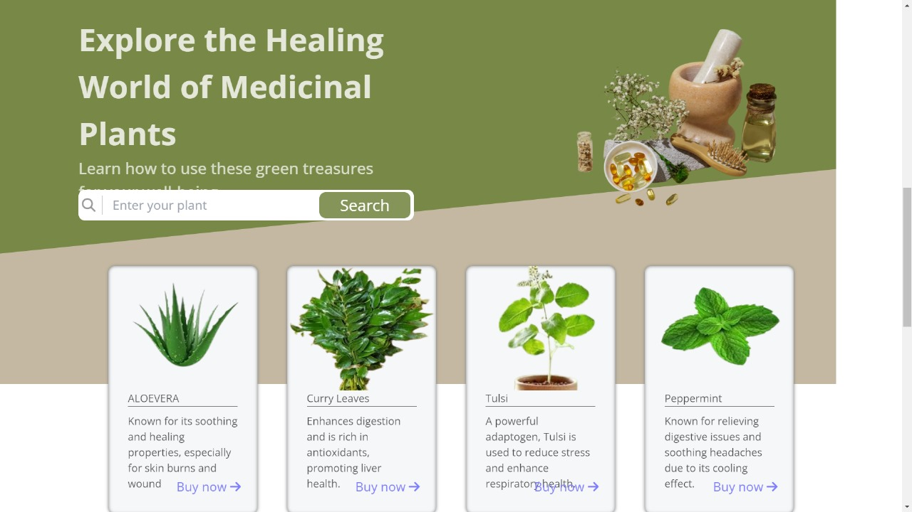
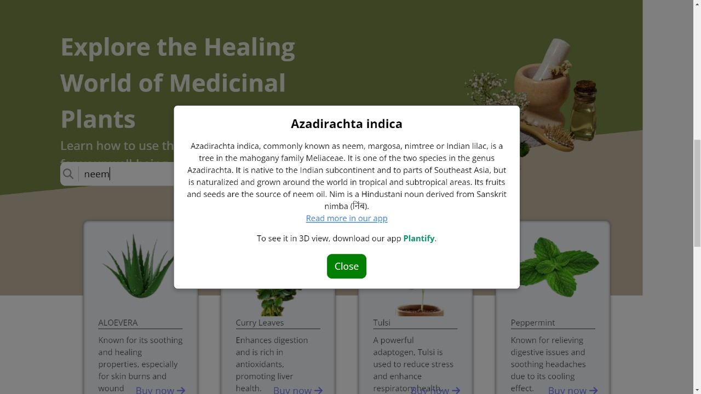
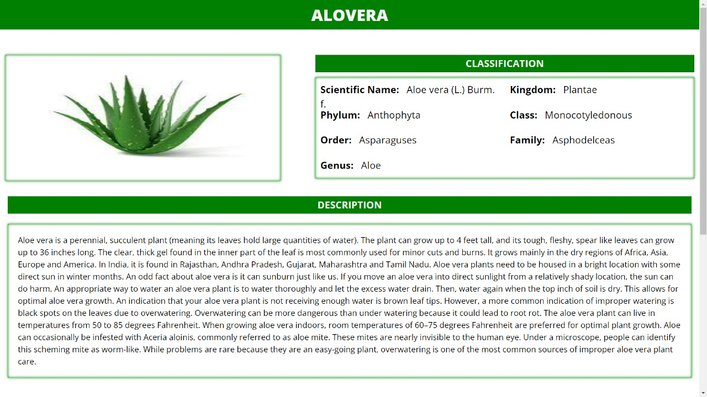
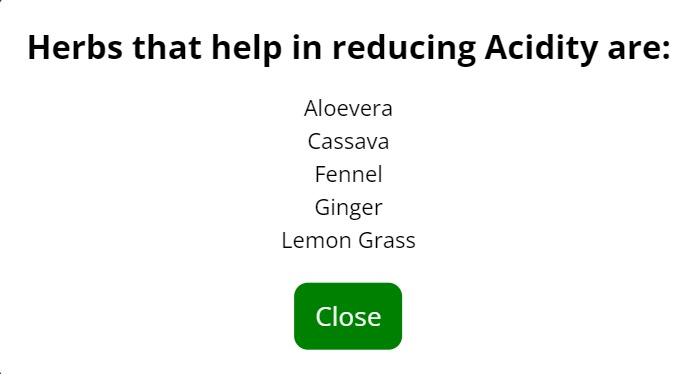
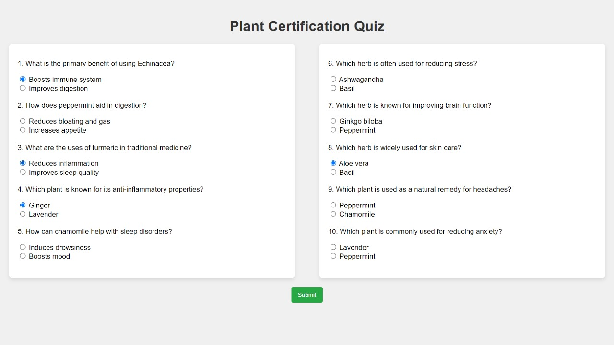

# Ayurvedic Plant Infosite 🌿

**Ayurvedic Plant Infosite** is a web-based platform designed to provide comprehensive information about various Ayurvedic plants and their medicinal properties. The site aims to promote awareness of traditional Ayurvedic knowledge and its relevance in modern-day health and wellness.

---

## Table of Contents

1. [Introduction](#introduction)  
2. [Features](#features)  
3. [Screenshots and Demo](#screenshots-and-demo)  
4. [Project Structure](#project-structure)  
5. [Installation and Setup](#installation-and-setup)  
6. [Usage](#usage)  
7. [Technologies Used](#technologies-used)  
8. [Contributing](#contributing)  
9. [License](#license)  
10. [Developer](#developer)

---

## Introduction

The **Ayurvedic Plant Infosite** provides detailed information about various Ayurvedic plants, including their medicinal properties, uses, and benefits. The site is designed to educate users about natural remedies and how these plants can contribute to health and wellness.

---

## Features

- **Comprehensive Plant Database**:  
  Provides detailed information about various Ayurvedic plants and herbs.

- **User-Friendly Interface**:  
  Simple and intuitive design for easy navigation and quick access to plant information.

- **Search Functionality**:  
  Allows users to search for specific plants by name or medicinal use.

- **Responsive Design**:  
  Adapts seamlessly to different screen sizes and devices.

---

## Screenshots and Demo

### Screenshot
Below is a screenshot of the Ayurvedic Plant Infosite:
### Home Page
  
### Plant Info Page
  
### Plant Details Page
 
### Remedy Page

### Disease Page
 
### 3D view Page

### Quiz Section Page

---

## Project Structure

```
Ayurvedic-Plant-Infosite/
│
├── index.html                     # Main HTML file
├── css/
│   └── style.css                  # Stylesheet for the site
├── js/
│   └── script.js                  # JavaScript for interactive functionality
├── images/                        # Folder containing images
│   └── infosite_screenshot.png    # Screenshot of the site
├── README.md                      # Project documentation
└── LICENSE                        # License file (optional)
```

---

## Installation and Setup

Follow these steps to set up and run the Ayurvedic Plant Infosite locally:

1. **Clone the Repository**:
   ```bash
   git clone https://github.com/Agrawalers/Ayurvedic-Plant-Infosite.git
   cd Ayurvedic-Plant-Infosite
   ```

2. **Open in a Browser**:
   - Open the `index.html` file in your preferred web browser.

---

## Usage

1. **Launch the Site**:  
   Open the `index.html` file to view the site in your browser.

2. **Explore Plant Information**:  
   Browse through the list of Ayurvedic plants and click on a plant to view detailed information.

3. **Search for Plants**:  
   Use the search bar to find specific plants by name or medicinal properties.

---

## Technologies Used

- **HTML**: For structuring the web pages.  
- **CSS**: For styling and layout of the site.  
- **JavaScript**: For adding interactive elements and search functionality.

---

## Contributing

Contributions are welcome! If you have suggestions to improve the site or want to add new features, feel free to fork the repository and submit a pull request.

### Steps to Contribute:

1. Fork the repository.  
2. Create a new branch (`git checkout -b feature-branch`).  
3. Commit your changes (`git commit -m 'Add new feature'`).  
4. Push to the branch (`git push origin feature-branch`).  
5. Open a pull request.

---

## License

This project is licensed under the MIT License. You are free to use, modify, and distribute the code as long as the license file is included in the project.

---

## Developer

**Kushagra Agrawal**  
- GitHub: [Agrawalers](https://github.com/Agrawalers)  
